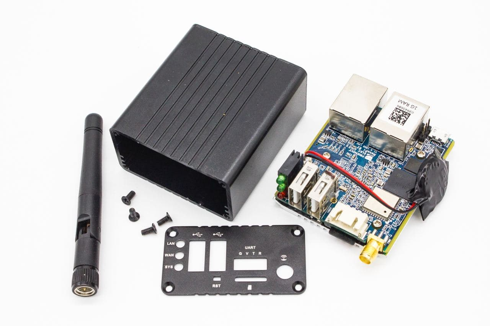
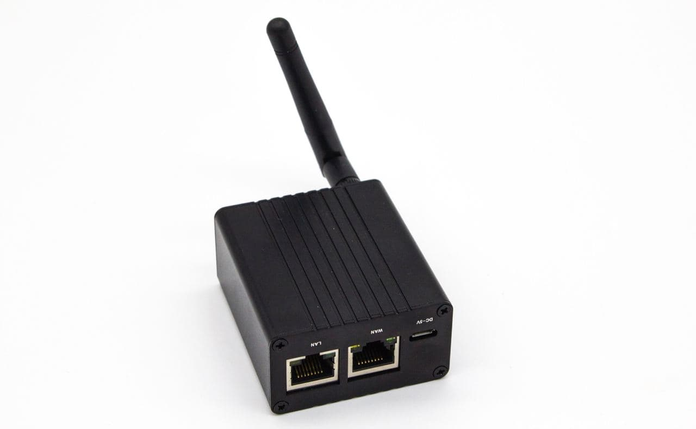
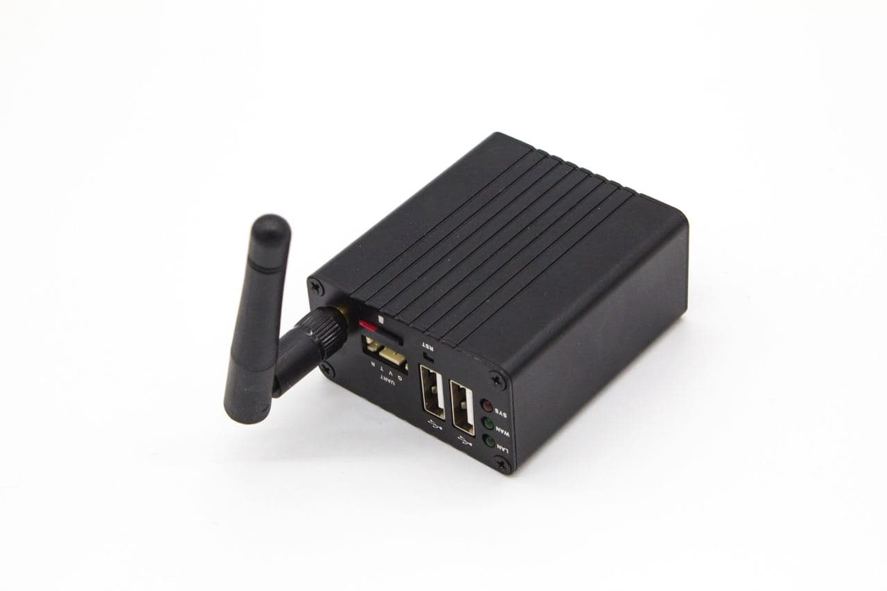
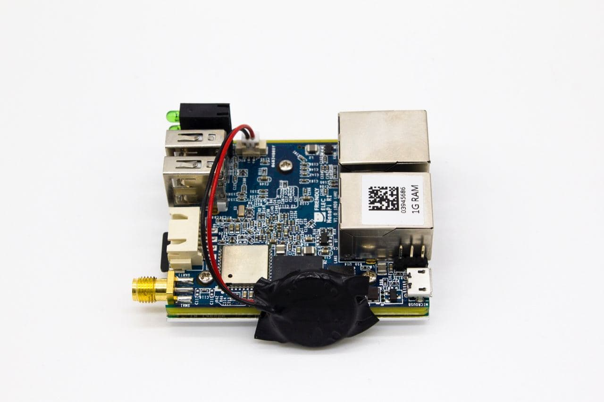

# ASKotec-nanopi



- Product Page: https://www.friendlyarm.com/index.php?route=product/product&product_id=248
- Documentation: http://wiki.friendlyarm.com/wiki/index.php/NanoPi_R1

Extra (good Product overview): https://www.aliexpress.com/item/32974701002.html

| Front side | Back side |
| ---------  | --------- |
|  |  |



## Flash SD Card:

```
sudo dd if=~/Downloads/nanopi-r1_eflasher_friendlywrt_4.14_armhf_20200414.img of=/dev/<NAME OF THE MOUNTED SD CARD> bs=32M
```
